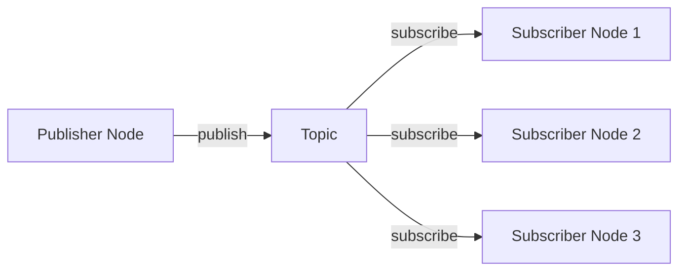
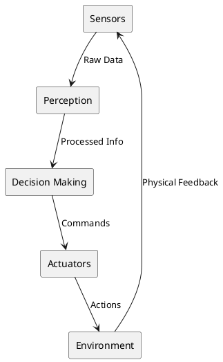

# Diagrams for Physical AI & Humanoid Robotics Textbook

This directory contains diagrams and visual assets for the textbook chapters.

## Directory Structure

```
img/diagrams/
├── foundations/
│   ├── embodied-intelligence/
│   ├── sensor-motor-loop/
│   └── robotics-architecture/
├── module-01-ros2/
│   ├── ros2-architecture/
│   ├── pub-sub-pattern/
│   ├── service-action-pattern/
│   ├── tf2-transforms/
│   ├── urdf-structure/
│   └── nav2-stack/
├── module-02-digital-twin/
│   ├── gazebo-architecture/
│   ├── sensor-models/
│   ├── unity-ros-bridge/
│   └── digital-twin-architecture/
├── module-03-isaac/
│   ├── isaac-sim-architecture/
│   ├── isaac-ros-pipeline/
│   ├── vslam-architecture/
│   ├── perception-pipeline/
│   ├── rl-workflow/
│   └── sensor-fusion/
└── module-04-vla/
    ├── humanoid-kinematics/
    ├── control-architecture/
    ├── grasp-planning/
    ├── walking-gaits/
    ├── vla-architecture/
    └── multimodal-integration/
```

## Diagram Types

### 1. Architecture Diagrams
- System component relationships
- Data flow between modules
- Software stack layers
- Hardware-software interfaces

### 2. Conceptual Diagrams
- Sensor-motor loops
- Control hierarchies
- Learning workflows
- State machines

### 3. Flowcharts
- Algorithm execution flow
- Decision trees
- Processing pipelines
- Task sequences

### 4. Data Flow Diagrams
- Topic/service/action communication
- Transform trees (TF2)
- Sensor data processing
- Multimodal data fusion

## Diagram Tools

Recommended tools for creating diagrams:

1. **Draw.io (diagrams.net)**
   - Free, web-based
   - Export to SVG/PNG
   - Good for architecture diagrams

2. **PlantUML**
   - Text-based diagram definition
   - Version control friendly
   - Great for sequence diagrams

3. **Mermaid**
   - Markdown-compatible
   - Supports flowcharts, sequence diagrams
   - Can be embedded in Docusaurus

4. **Inkscape**
   - Professional vector graphics
   - SVG native format
   - Good for detailed technical drawings

5. **Blender**
   - 3D robot models
   - Kinematic visualizations
   - Export to images/videos

## Style Guidelines

### Colors
- **Primary**: #1976D2 (Blue) - Main concepts
- **Secondary**: #FF9800 (Orange) - Highlights
- **Success**: #4CAF50 (Green) - Positive flow
- **Warning**: #FFC107 (Yellow) - Warnings
- **Error**: #F44336 (Red) - Errors
- **Neutral**: #757575 (Gray) - Background elements

### Typography
- **Font**: Arial, Helvetica, or Sans-serif
- **Titles**: 16-18pt, bold
- **Labels**: 12-14pt, regular
- **Annotations**: 10-11pt, italic

### Layout
- Consistent spacing (use grid)
- Left-to-right or top-to-bottom flow
- Group related components
- Use arrows to show direction
- Add legends for complex diagrams

### File Formats
- **SVG**: Preferred for diagrams (scalable, small file size)
- **PNG**: For screenshots and photos (300 DPI for print)
- **WebP**: Alternative for web (smaller file size)

## Naming Convention

Format: `{chapter-num}-{topic}-{description}.{ext}`

Examples:
- `01-ros2-pub-sub-architecture.svg`
- `07-gazebo-physics-engine-stack.png`
- `17-humanoid-kinematics-chain.svg`

## Usage in Markdown

### Inline Image
```markdown

```

### Image with Caption
```markdown
<figure>
  
  <figcaption>Figure 1: ROS 2 system architecture showing nodes, topics, services, and actions</figcaption>
</figure>
```

### Side-by-Side Images
```markdown
<div style={{display: 'flex', gap: '20px'}}>
  
  
</div>
```

## Diagram Checklist

Before adding a diagram, ensure:

- [ ] Clear title and labels
- [ ] Consistent color scheme
- [ ] Readable text (even when scaled)
- [ ] Proper file format (SVG preferred)
- [ ] Descriptive filename
- [ ] Alt text for accessibility
- [ ] Source file saved (if editable format like .drawio)
- [ ] Proper attribution if using external sources

## Creating Diagrams

### Example: ROS 2 Pub/Sub Pattern

```xml
<!-- Using Mermaid in Markdown -->

<!-- end mermaid -->

### Example: Sensor-Motor Loop



## Contributing Diagrams

When contributing new diagrams:

1. **Check if diagram exists**: Search existing diagrams first
2. **Use templates**: Start from existing diagrams when possible
3. **Follow guidelines**: Adhere to style and naming conventions
4. **Provide source**: Include editable source file (.drawio, .puml, etc.)
5. **Test rendering**: Verify diagram displays correctly in Docusaurus
6. **Add alt text**: Include descriptive alternative text for accessibility

## Diagram Templates

Templates are available in `/static/img/diagrams/templates/`:
- `architecture-template.drawio`
- `flowchart-template.drawio`
- `data-flow-template.drawio`
- `sequence-diagram-template.puml`

## License

All diagrams are licensed under Creative Commons Attribution 4.0 (CC BY 4.0) unless otherwise specified. When using diagrams from external sources, proper attribution must be included.

## Resources

- [Draw.io](https://app.diagrams.net/)
- [PlantUML Documentation](https://plantuml.com/)
- [Mermaid Live Editor](https://mermaid.live/)
- [Docusaurus Image Best Practices](https://docusaurus.io/docs/markdown-features/assets)
